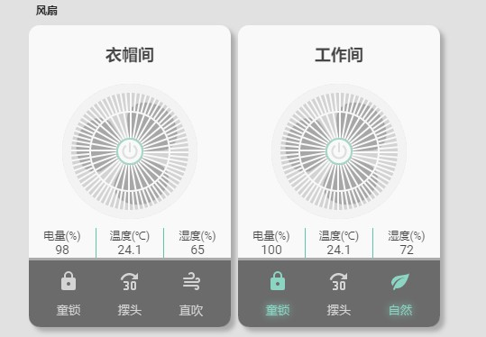

<!--
 * @Author        : fineemb
 * @Github        : https://github.com/fineemb
 * @Description   : 
 * @Date          : 2019-10-13 17:46:58
 * @LastEditors   : fineemb
 * @LastEditTime  : 2019-10-13 18:27:00
 -->
# 小米电风扇卡片
+  这个卡片插件是用于HASS, 支持HACS安装
+  支持对小米风扇的各种操作
+  独特的动画效果

## HACS安装
在商店里搜索Lovelace-fan-xiaomi
## 手动安装
下载fan-xiaomi.js 复制到你的www\community\lovelace-fan-xiaomi\fan-xiaomi.js
然后添加一下资源
``` yaml
resources:
  - url: /community_plugin/lovelace-fan-xiaomi/fan-xiaomi.js?v=0.2
    type: js
```
``` yaml
      - type: 'custom:fan-xiaomi'
        name: 测试
        entity: fan.zhi_neng_dian_feng_shan_1
```
## 请你欣赏


## 感谢
[shaonianzhentan](https://github.com/shaonianzhentan/) 

[花神](https://github.com/yaming116)
